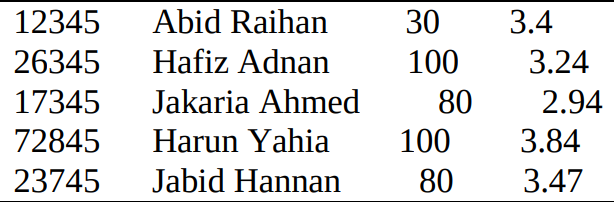
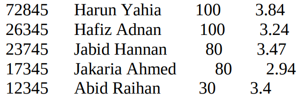

# Course Registration Scheduler

This project was created for an assignment required by the course CSE 373 ("Design and Analysis of Algorithms") at North South University. 

# Features
### Input
A text file should contain all info of students. Each line of this file should contain the id, name, credits_completed, and CGPA separated by tabs; e.g.  




A number will be read from user, which defines the sorting algorithm desired. e.g. 
  - 1 for QuickSort
  - 2 for InsertionSort
  - 3 for MergeSort
  - 4 for HeapSort

### Output
A text file will be created,  containing the student-records in sorted order; e.g. for the above input the output.txt should look like: 



It can be seen that the time taken to complete the sorting (in micro-second or milli-second) is shown in the console. 

### Description
This was an assignment in university that me and my friend ( https://github.com/mahieyin-rahmun ) implemented. The task here was to create a student list for a course registration schedule. The rules are the following: 
- Student s1 should come before Student s2 if either 
    - (i) s1 completed more credits than s2 or 
    - (ii) s1 and s2 completed same number of credits but s1 has higher CGPA than s2.

##### Sample Cases
Consider two students: s1 and s2
> If s1 and s2 completed 100 and 110 credits respectively, then s1 should come before s2 in the sorted order. 

> If both of them completed same credits each, then the one with higher CGPA will come before the other one; e.g. if s1 and s2 both completed 100 credits each but s1 had 3.5 CGPA whereas s2 had 3.2 CGPA then s1 should come before s2 in the sorted order.

### How to run this code

```sh
python sort.py
```

